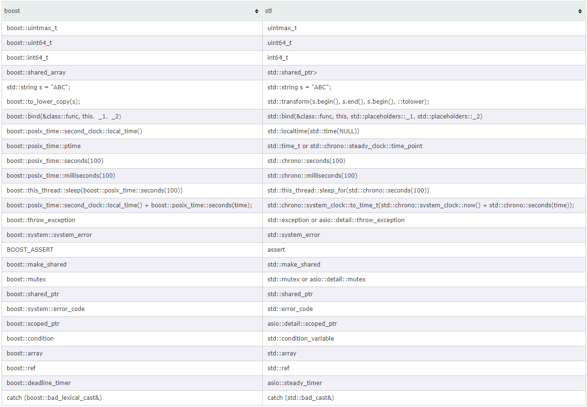

# STL与Boost的苟且

## STL

* STL是**standard Template Library**即标准模板库的英文缩写，是**惠普实验室开发**(为嘛不是C++委员会？)的一系列软件的统称。
* **从根本上讲,STL是一些“容器”的集合**，这些容器有list,vector,map,set等，同时它也是一些算法和其他组件的集合。
* STL的**目的就是标准化组件，不用再重新开发**，可以使用现成的组件。
* **STL现在是C++的一部分，因此不用额外安装。**
* STL的代码从广义上讲分为三类：algorithm（算法）、container（容器）和iterator（迭代器）
* 几乎所有的代码都采用了模板类和模版函数的方式，这相比于传统的由函数和类组成的库来说提供了更好的代码重用机会。
* 库的目标本来就是要避免重复造轮子，并且尽可能通用，尽可能高效。如果你自己写一个也可以称为库，没毛病，通用不？效率呢？人都说高效且跨平台。能够被称为标准，说明大多数人认同这是解决该类问题相对比较合适的办法，当然不是绝对优秀
* 内核的话，极少依赖库，毕竟内核效率要求极高，宁愿重复造轮子，也不能用通用方法解决特定问题。

在C++标准中，STL被组织为下面的17个头文件：
```
<algorithm>、<deque>、<functional>、
<iterator>、<array>、<vector>、
<list>、<forward_list>、<map>、
<unordered_map>、<memory>、<numeric>、
<queue>、<set>、<unordered_set>、<stack>、<utility>。
```

* STL可分为容器(containers)、迭代器(iterators)、空间配置器(allocator)、配接器(adapters)、算法(algorithms)、仿函数(functors)六个部分

* 关于容器的理解：容器就是数据在内存中组织的方法，例如数组、堆栈、队列、链表和二叉树等。通俗点就是装东西的东西；如杯子

* 对算法的理解：是应用在容器上以各种方法处理其数据的的功能和行为。例如对其数据进行排序、检索和合并等的算法。通俗讲就是就是处理容器里面数据的方法，如往杯子里面倒水。

* 迭代器：迭代器就是使容器和数据行为（算法）相互作用，可以把迭代器看做是指向容器中元素的一个普通指针，可以依次指向元素的一个后继元素。**迭代器将容器和算法联系在了一起**。通俗讲，迭代器就是往杯子里面倒水的水壶，把杯子和水联系在了一起，起到一个**中介的作用**。

## Boost库

* Boost库是为C++语言标准库提供扩展的一些C++程序库的总称。
* 其目的是为C++程序员提供免费、同行审查的、可移植的程序库。
* Boost库可以与C++标准库完美共同工作，并且为其提供扩展功能。
* **Boost库使用Boost License来授权使用，根据该协议，商业的非商业的使用都是允许并鼓励的。**
* Boost 库通过加入一些在实践中非常有用的函数对 C++ 标准进行了**补充**。
* 由于 Boost C++ 库是基于 C++ 标准的，所以它们是使用最先进的 C++ 来实现的。 它们是平台独立的，并由于有一个大型的开发人员社区，它可以被包括 Windows 和 Linux 在内的许多操作系统所支持。
* Boost库由C++标准委员会库工作组成员发起（STL是惠普实验室开发，委员会也想搞一个免得被抢风头），其中有些内容**有望成为下一代C++标准库内容**。
* 在C++社区中影响甚大，是不折不扣的“准”标准库。
* Boost由于其对**跨平台**的强调，对标准C++的强调，与编写平台无关。
* 大部分boost库功能的使用只需包括相应头文件即可，少数（如正则表达式库，文件系统库等）需要链接库。可以说，**Boost库是为C++语言标准库提供扩展的一些C++程序库的总称**。

## 为什么需要学习STL

* STL是 C++的ANSI/ISO 标准的一部分,可以用于所有C++语言编译器和所有平台(Windows/Unix/Linux..)。STL的同一版本在任意硬件配置下都是可用的；
* STL 提供了大量的可复用软件组织。例如，程序员再也不用自己设计排序，搜索算法了，这些都已经是STL的一部分了。嘎嘎，有意思吧；
* 使用STL 的应用程序保证了得到的实现在处理速度和内存利用方面都是高效的，因为STL设计者们已经为我们考虑好了；
* 使用STL编写的代码更容易修改和阅读，这是当然的鸟。因为代码更短了，很多基础工作代码已经被组件化了；
* 使用简单，虽然内部实现很复杂；
* 感觉STL更通用，bootst更复杂，复杂不仅仅在于内容增加，而且它本身设计为了兼容做了很多复杂工作，如果你编译不开启优化选项，那真的会很尴尬的低效。还并不能成为标准，你造为嘛？只能说准标准
* 好多大佬都建议，能不用则不用。要用的话就用到底，真的有些大型项目确实，为了快速开发，只是针对开发速度，不是说极致效率，就得用它，哪怕牺牲一部分效率，也要尽快完成任务。。。
* C/C++面试的时候就经常会问这类问题，个人感觉还是看看本质的比较合适，这类库，基本了解，等用到了再学也不迟。基本功摆在那，如果一开始就啃那波库，你不懵逼？？
* 有时间先学学STL，吃透源码再说，boost作为了解哈。个人建议

虽然，STL的优点甚多，但是STL的语法实在令初学者人头疼，许多人望而却步。可是STL是每个C++程序设计者迟早都要啃的一块骨头。

因为越来越多的C++代码是用STL编写的，看不懂麻烦就大鸟。越来越多的人在用STL，不懂就无法和别人一起合作了。好事多磨嘛，早点学习早点解脱。

## 函数比较




## 参考文献

<https://www.cnblogs.com/maybe2030/p/5299577.html#_label1>
<http://blog.sina.com.cn/s/blog_4bbfa6a101000ay2.html>
